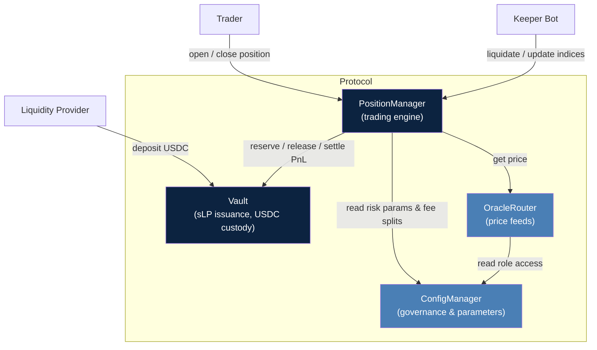
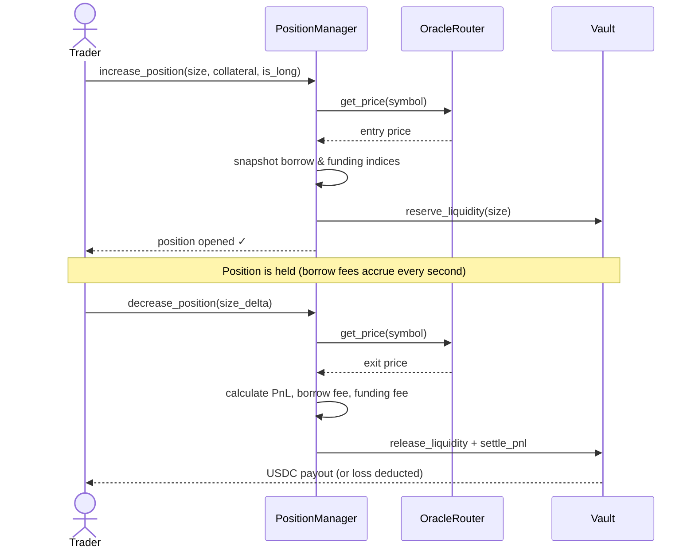
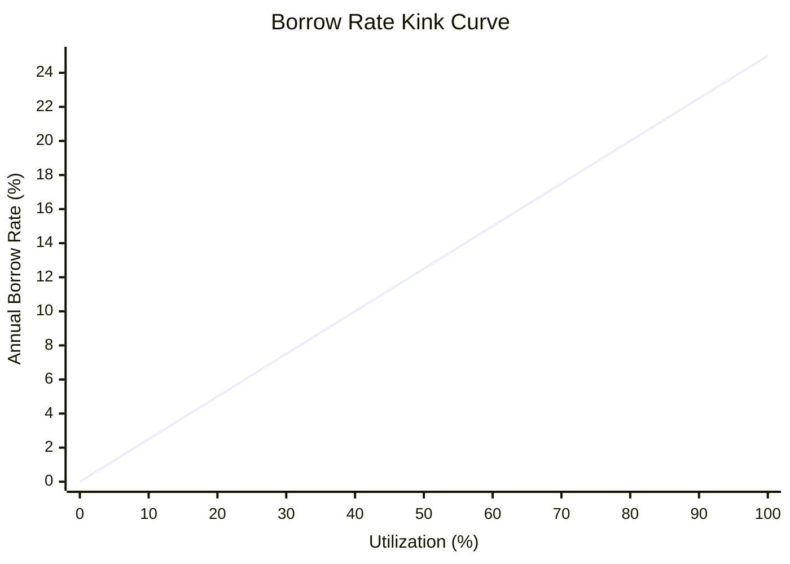
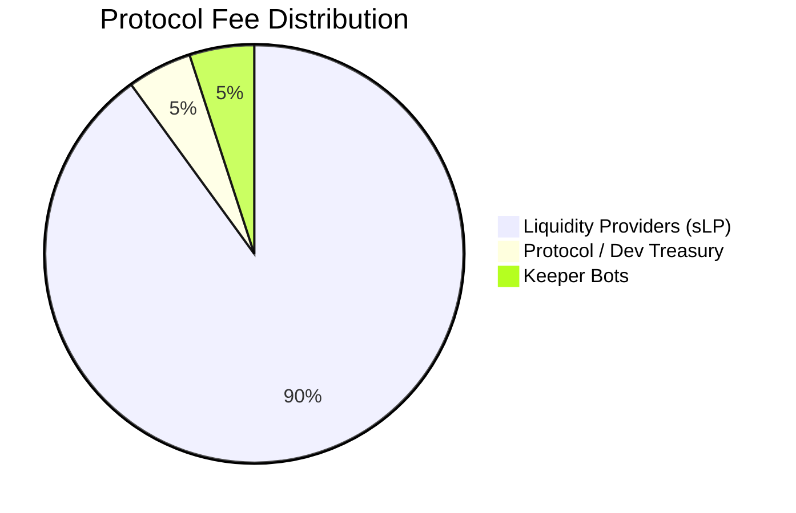
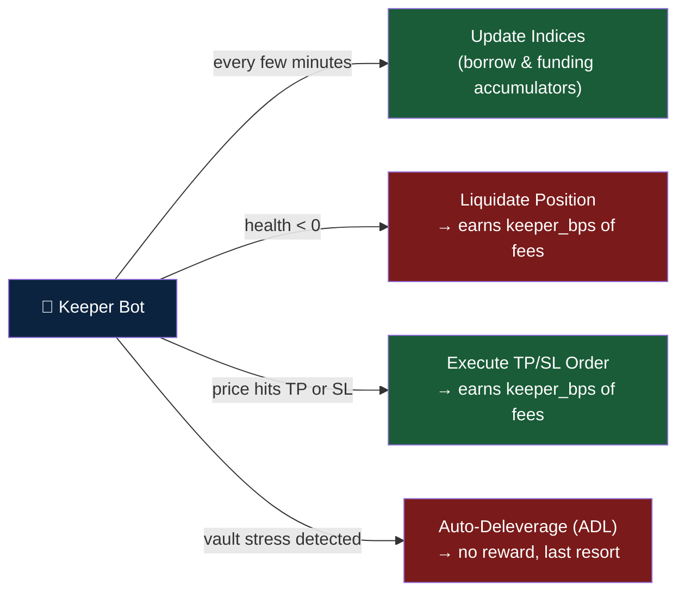
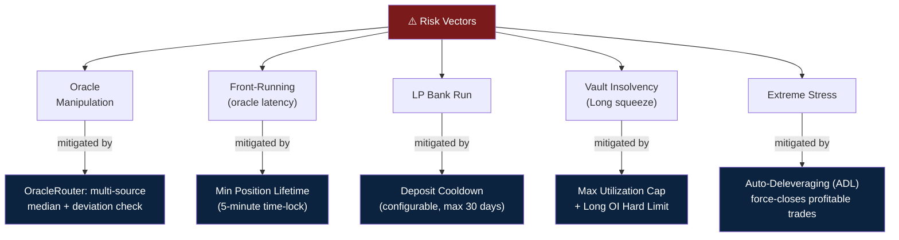
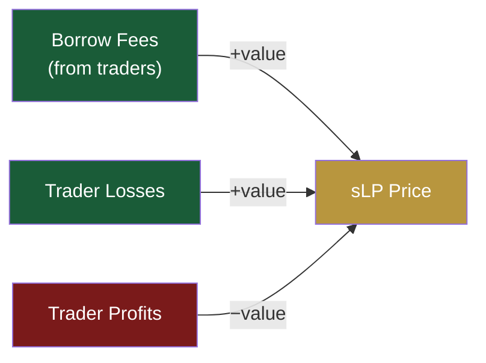
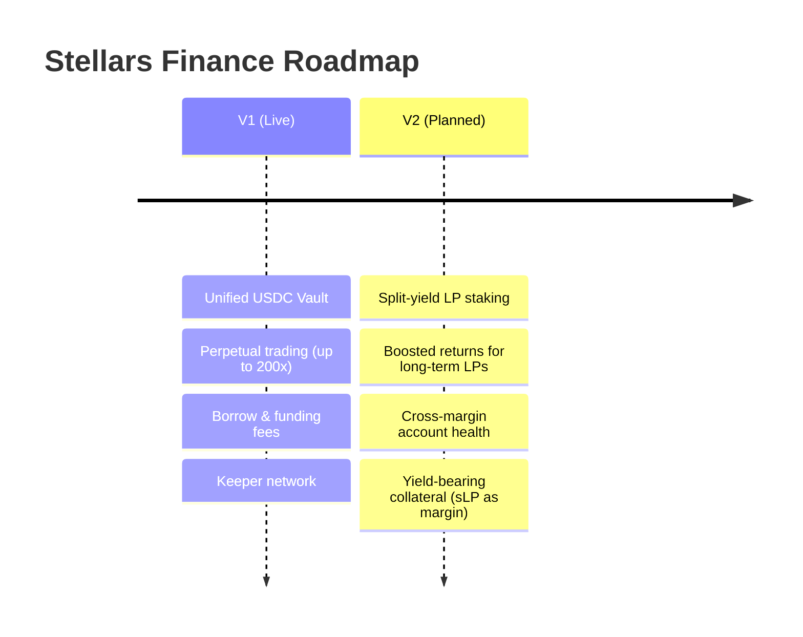

# Stellar Financial Document

*A plain-language guide to the protocol's mechanics and revenue model.*

---

## What Is Stellars Finance?

Stellars Finance is a decentralized perpetual futures exchange built on the **Soroban smart contract platform** (Stellar blockchain). It lets traders open leveraged Long or Short positions on any supported asset — without a centralized intermediary and without order books.

Instead of matching buyers with sellers, the protocol uses a **unified liquidity pool** model. All traders trade against the pool, and Liquidity Providers (LPs) collectively act as the counterparty to every trade.

---

## Protocol Architecture

The protocol is composed of four smart contracts that interact in a strict hierarchy:

---

## The Two Participants

### 1. Liquidity Providers (LPs)

LPs deposit **USDC** into the Vault. In return, they receive **sLP** — a liquid, interest-bearing token that represents their share of the pool (following the ERC-4626 standard).

The value of sLP adjusts automatically based on:
- Protocol fees earned from traders
- Net profit/loss of all active positions (if traders are losing, the pool gains; if traders are winning, the pool pays out)

LPs can withdraw their USDC at any time, subject to a cooldown period after depositing (up to 30 days, configurable) to prevent front-running.

### 2. Traders

Traders deposit USDC as **collateral** and use it to open leveraged Long or Short positions. The protocol supports leverage up to 200x on supported assets, configurable per market.

Positions are priced using oracle feeds from the **OracleRouter**, which aggregates multiple sources and returns a secure median price to prevent manipulation.

---

## How Positions Work

### Position Lifecycle

Question: does the valut will buy/sell the token that trader is calling?

### Opening a Position

A trader specifies: which asset, position size, collateral amount, direction (Long or Short), and optionally a Take Profit or Stop Loss price. The protocol:

1. Records the entry price from the oracle

> how long does the price stands? There should be a delay between show client the quote and the actual trade submit. Solution: 1. Quote only valid for 1~2 Seconds. Inform trader(user) a small slippage. 2. Quote valid for 10 seconds, inform a bigger slippage. Suggestion: don't hard code it, keep it dynamic and we will observe and change when user using it.

2. Transfers collateral from the trader to the protocol
3. Reserves the equivalent liquidity in the Vault so winning traders can always be paid out
4. Snapshots the current borrow and funding indices for future fee calculation

### Closing a Position

When a trader closes, the protocol calculates:

- **Unrealized PnL** — based on the price move since entry
- **Borrow fees** accrued while the position was open
- **Funding fees** received or paid based on market imbalance

The trader receives: `collateral + PnL − borrow fees ± funding fees`. If the net is negative, the trader loses their collateral. If positive, the Vault pays out the profit.

---

## How Stellars Earns Revenue

The protocol generates revenue from three sources:

### 1. Borrow Fees

Traders pay a continuous borrowing fee for keeping a position open. This compensates LPs for the opportunity cost of having their capital locked as reserved liquidity.

The borrow rate follows a **kink curve** — a two-slope model that responds to how much of the pool is in use:

- **Below 80% utilization (normal):** Rate = Base Rate + (Utilization × Slope 1)
- **Above 80% utilization (high demand):** Rate = Base Rate + (80% × Slope 1) + ((Utilization − 80%) × Slope 2)

Slope 2 is significantly steeper than Slope 1, creating a strong economic incentive for utilization to stay below the 80% threshold.

> *Normal zone (0–80%): rate rises gradually with Slope 1. Above 80%: Slope 2 kicks in, sharply increasing the cost of capital to deter over-utilization.*

Fees accrue every second using a **cumulative index** — a gas-efficient method where the protocol tracks a global "odometer" rather than updating every position individually. When a position closes, fees are calculated as:

> `Fee = Position Size × (Current Index − Entry Index)`

### 2. Funding Rate

The funding rate keeps the perpetual contract price aligned with the spot market. It is a **peer-to-peer transfer** between Long and Short holders, proportional to the imbalance between them:

> `Funding Rate = Base Rate × (Long OI − Short OI) / (Long OI + Short OI)`

- When Longs exceed Shorts, Longs pay Shorts.
- When Shorts exceed Longs, Shorts pay Longs.

The protocol takes a small cut (`funding_cut_bps`) from traders who *receive* positive funding, which accrues alongside borrow fees as protocol revenue.

### 3. Liquidation Fees

When a position's health falls below zero, it is liquidated by a Keeper bot. All remaining collateral is seized and flows to the Vault. The executing Keeper receives a `keeper_bps` share as an incentive.

> **Health** = Collateral + Unrealized PnL − Borrow Fee + Funding Fee

---

## Revenue Distribution

All fees are split automatically according to configurable parameters stored in the **ConfigManager**. The default split is:

| Recipient | Share | How it flows |
|---|---|---|
| Liquidity Providers (sLP pool) | 90% | Retained in Vault; increases sLP exchange rate |
| Protocol / Dev | 5% | Accrues to treasury; claimed by admin |
| Keeper bots | 5% | Paid directly on liquidations & TP/SL executions |

---

## Keeper Network

Keepers are off-chain bots that maintain system health. Their responsibilities and incentives:

ADL is a last-resort mechanism. If aggregate trader profits become too large relative to Vault assets, Keepers can force-close the most profitable positions (paying traders in full) to restore the Vault's solvency. There is no Keeper reward for ADL.

---

## Risk Controls

The protocol enforces several safeguards to remain solvent under adverse conditions:

**Utilization cap** — total reserved liquidity cannot exceed a configurable percentage of the Vault, preventing over-commitment.

**Minimum position lifetime** — positions must be held for at least 5 minutes before they can be closed. This eliminates risk-free arbitrage against oracle latency.

**LP cooldown** — LPs cannot withdraw immediately after depositing, preventing extraction of value during liquidation events.

**Oracle aggregation** — the OracleRouter queries multiple price sources and returns a median, rejecting stale or deviant data.

**Long OI cap** — because USDC-only vaults have asymmetric long exposure (shorts are capped at 100% loss, longs are theoretically unlimited), the protocol enforces a hard cap on total long open interest relative to Vault size.

---

## The sLP Token in Practice

The value of sLP auto-compounds continuously — there is no manual claim. As the pool earns borrow fees and benefits from trader losses, the USDC redeemable per sLP increases. Conversely, a sustained period of large trader profits will reduce the sLP exchange rate.

This makes sLP a yield-bearing position with real, bidirectional exposure to the market — not a fixed APY product.

---

## V2 Roadmap (Planned)

The V1 architecture prioritizes simplicity and solvency. V2 is planned to introduce:

- **Split-yield LP staking** — separating fee revenue from trader PnL exposure, with time-locked staking for boosted returns
- **Cross-margin** — a single account health score across multiple positions, allowing winning positions to offset losing ones
- **Yield-bearing collateral** — allowing staked sLP to serve as trading collateral, so users can simultaneously earn LP yield and hold leveraged positions

---

*For technical specifications, see the Stellars Finance smart contract documentation.*
